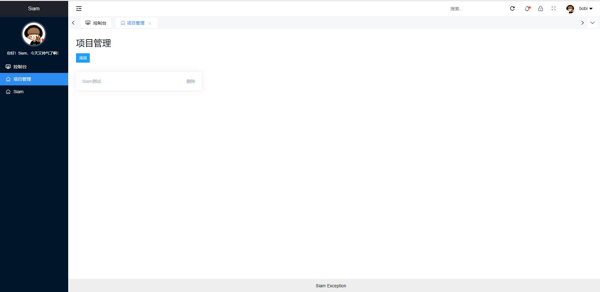
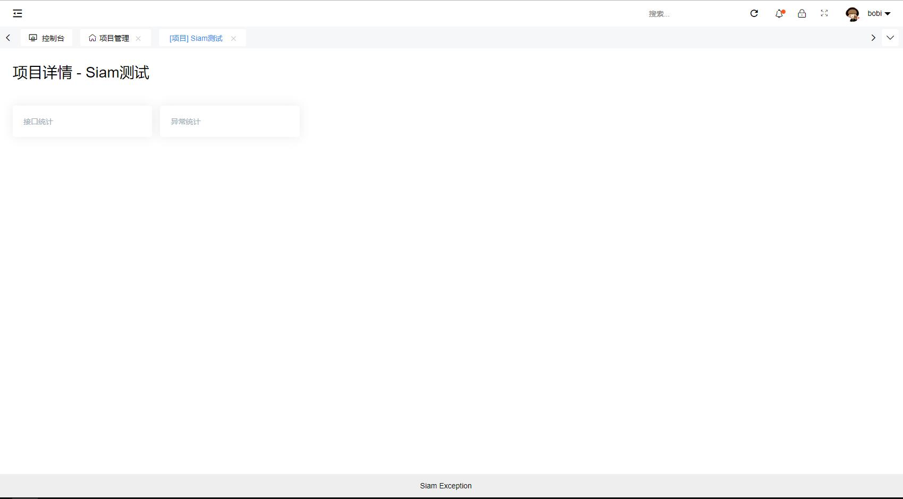
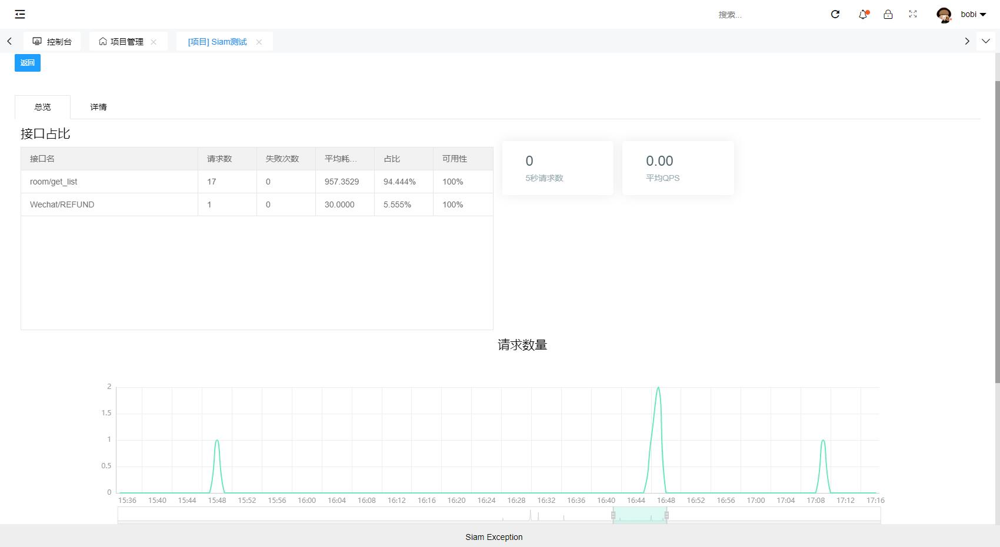
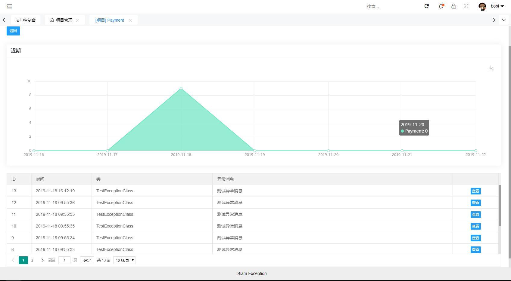

Siam Project Manage
===============

致敬其他开源项目

- Thinkphp 6.0
- ok-admin UI
- guzzle

等等

# 功能介绍

SPM，自己工作过程中需求，顺便整理开源，作为一个中间统计平台，可以快速分析API频率、可用性等；记录程序异常参数和原因、快速复原崩溃过程、定位程序bug；管理项目事务（任务安排、规划）；日志储存，使用唯一标识储存（如订单号）、指定查询。

个人负责项目较多，每个项目都写一遍这些模块有点累人，于是写了这个统计平台。

其他项目通过HTTP、UDP、直连数据库等方式上报数据，日常管理只需要从SPM平台查看数据。

# 截图预览









其他待完成...

# 安装

- clone 此git仓库到本地，php环境指向public目录，Thinkphp6.0(建议先看框架文档)
- 前端页面为 ```www.root.com/UI/index.html```
- 修改前端配置文件 ```/UI/lib/layui/lay/okmodules/siamConfig.js```文件
- - url  api 路径  为以上部署域名指定 ```www.root.com/index.php```
- - isFrontendBackendSeparate 是否前后分离 默认true
- 导入根目录/database.sql到mysql数据库中
- 修改Thinkphp程序数据库配置文件   copy根目录的.example.env  命名为.env 并且修改其中的配置项
